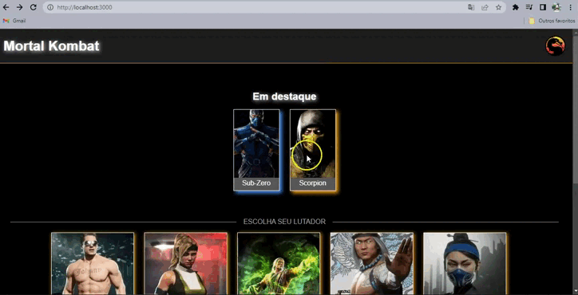
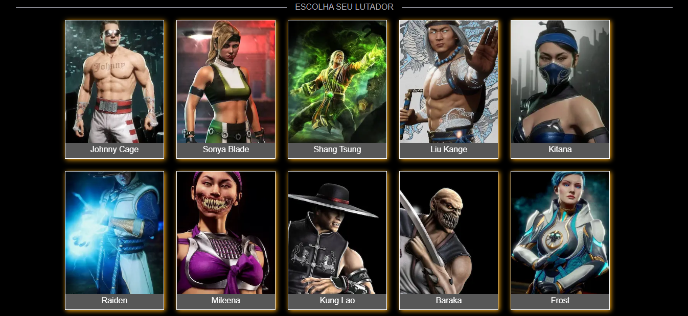

<p align="center">
 

  
</p>

## Tecnologias

- ReactJS
- NextJS
- Sass
- Typescript
- Axios

</br>

### Como rodar o projeto

```bash
# Clone este repositório
$ git clone <https://github.com/Maria-Eduarda90/MK11-Characters>

# Acesse a pasta do projeto no terminal/cmd
$ cd MK11-Characters

# Instale as dependências
$ npm i or yarn

# Execute a aplicação em modo de desenvolvimento
$ npm run dev or yarn dev

```

</br>

<h1 align="center"> 
	Projeto  
</h1>

<h1 align="center">
  
</h1>

<h1 align="center">
  
</h1>